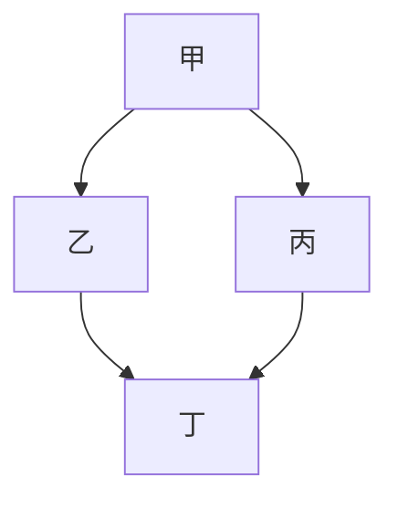
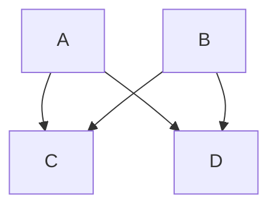

# Chapter 1

中文看看可以嗎?

[Google](http://google.com "google link")

`hello again`

> so this is the block quote of something, that is not a very good thing. but 
how about the the other line and another line
for the third line 那麽, 加一些中文字可以嗎?看來應該是可以的。
or the forth line 
or the fifth one. What do you think?

Now we are leaving the block quote.

